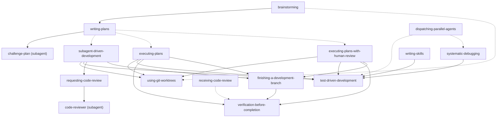

# Superpowers

Superpowers is a complete software development workflow for your coding agents, built on top of a set of composable "skills" and some initial instructions that make sure your agent uses them.

## How it works

It starts from the moment you fire up your coding agent. As soon as it sees that you're building something, it *doesn't* just jump into trying to write code. Instead, it steps back and asks you what you're really trying to do. 

Once it's teased a spec out of the conversation, it shows it to you in chunks short enough to actually read and digest. 

After you've signed off on the design, your agent puts together an implementation plan that's clear enough for an enthusiastic junior engineer with poor taste, no judgement, no project context, and an aversion to testing to follow. It emphasizes true red/green TDD, YAGNI (You Aren't Gonna Need It), and DRY. 

Next up, once you say "go", it launches a *subagent-driven-development* process, having agents work through each engineering task, inspecting and reviewing their work, and continuing forward. It's not uncommon for Claude to be able to work autonomously for a couple hours at a time without deviating from the plan you put together.

There's a bunch more to it, but that's the core of the system. And because the skills trigger automatically, you don't need to do anything special. Your coding agent just has Superpowers.

## Workflows

The diagram below shows the workflows an engineer can take using the skills and agents provided by this plugin. Solid lines indicate a skill/agent that **always** calls another; dotted lines indicate **conditional** calls.



## Differences from the original Superpowers

This version of Superpowers is a fork of [the original Superpowers plugin](https://github.com/obra/superpowers/). The main differences are:

* New skill `superpowers:executing-plans-with-human-review` that adds a mandatory human review gate before marking any task complete. If the reviewer requests changes, assess plan impact and update the plan document before implementing.
* New skill `superpowers:challenge-plan`, which is automatically executed by a subagent after the implementation plan is written. This skill challenges the implementation plan before executing it. This skill is always triggered by the skill `writing-plans`.
* The skill `writing-plans` doesn't automatically triggers `superpowers:subagent-driven-development` anymore. Instead, it asks the user which implementation approach to follow:
    * Option 1: Subagent-Driven Development (skill `superpowers:subagent-driven-development`)
    * Option 2: Executing Plans (skill `superpowers:executing-plans`)
    * Option 3: Executing Plans with Human Review (skill `superpowers:executing-plans-with-human-review`)

## Sponsorship

If Superpowers has helped you do stuff that makes money and you are so inclined, I'd greatly appreciate it if you'd consider [sponsoring my opensource work](https://github.com/sponsors/obra).

Thanks! 

- Jesse


## Installation

**Note:** Installation differs by platform. Claude Code or Cursor have built-in plugin marketplaces. Codex and OpenCode require manual setup.

### Claude Code Official Marketplace

Superpowers is available via the [official Claude plugin marketplace](https://claude.com/plugins/superpowers)

Install the plugin from Claude marketplace:

```bash
/plugin install superpowers@claude-plugins-official
```

### Claude Code (via Plugin Marketplace)

In Claude Code, register the marketplace first:

```bash
/plugin marketplace add obra/superpowers-marketplace
```

Then install the plugin from this marketplace:

```bash
/plugin install superpowers@superpowers-marketplace
```

### Cursor (via Plugin Marketplace)

In Cursor Agent chat, install from marketplace:

```text
/add-plugin superpowers
```

or search for "superpowers" in the plugin marketplace.

### Codex

Tell Codex:

```
Fetch and follow instructions from https://raw.githubusercontent.com/obra/superpowers/refs/heads/main/.codex/INSTALL.md
```

**Detailed docs:** [docs/README.codex.md](docs/README.codex.md)

### OpenCode

Tell OpenCode:

```
Fetch and follow instructions from https://raw.githubusercontent.com/obra/superpowers/refs/heads/main/.opencode/INSTALL.md
```

**Detailed docs:** [docs/README.opencode.md](docs/README.opencode.md)

### Gemini CLI

```bash
gemini extensions install https://github.com/obra/superpowers
```

To update:

```bash
gemini extensions update superpowers
```

### Verify Installation

Start a new session in your chosen platform and ask for something that should trigger a skill (for example, "help me plan this feature" or "let's debug this issue"). The agent should automatically invoke the relevant superpowers skill.

## The Basic Workflow

1. **brainstorming** - Activates before writing code. Refines rough ideas through questions, explores alternatives, presents design in sections for validation. Saves design document.

2. **using-git-worktrees** - Activates after design approval. Creates isolated workspace on new branch, runs project setup, verifies clean test baseline.

3. **writing-plans** - Activates with approved design. Breaks work into bite-sized tasks (2-5 minutes each). Every task has exact file paths, complete code, verification steps.

4. **subagent-driven-development** or **executing-plans** - Activates with plan. Dispatches fresh subagent per task with two-stage review (spec compliance, then code quality), or executes in batches with human checkpoints.

5. **test-driven-development** - Activates during implementation. Enforces RED-GREEN-REFACTOR: write failing test, watch it fail, write minimal code, watch it pass, commit. Deletes code written before tests.

6. **requesting-code-review** - Activates between tasks. Reviews against plan, reports issues by severity. Critical issues block progress.

7. **finishing-a-development-branch** - Activates when tasks complete. Verifies tests, presents options (merge/PR/keep/discard), cleans up worktree.

**The agent checks for relevant skills before any task.** Mandatory workflows, not suggestions.

## What's Inside

### Skills Library

**Testing**
- **test-driven-development** - RED-GREEN-REFACTOR cycle (includes testing anti-patterns reference)

**Debugging**
- **systematic-debugging** - 4-phase root cause process (includes root-cause-tracing, defense-in-depth, condition-based-waiting techniques)
- **verification-before-completion** - Ensure it's actually fixed

**Collaboration** 
- **brainstorming** - Socratic design refinement
- **writing-plans** - Detailed implementation plans
- **executing-plans** - Batch execution with checkpoints
- **dispatching-parallel-agents** - Concurrent subagent workflows
- **requesting-code-review** - Pre-review checklist
- **receiving-code-review** - Responding to feedback
- **using-git-worktrees** - Parallel development branches
- **finishing-a-development-branch** - Merge/PR decision workflow
- **subagent-driven-development** - Fast iteration with two-stage review (spec compliance, then code quality)

**Meta**
- **writing-skills** - Create new skills following best practices (includes testing methodology)
- **using-superpowers** - Introduction to the skills system

## Philosophy

- **Test-Driven Development** - Write tests first, always
- **Systematic over ad-hoc** - Process over guessing
- **Complexity reduction** - Simplicity as primary goal
- **Evidence over claims** - Verify before declaring success

Read more: [Superpowers for Claude Code](https://blog.fsck.com/2025/10/09/superpowers/)

## Contributing

Skills live directly in this repository. To contribute:

1. Fork the repository
2. Create a branch for your skill
3. Follow the `writing-skills` skill for creating and testing new skills
4. Submit a PR

See `skills/writing-skills/SKILL.md` for the complete guide.

## Updating

Skills update automatically when you update the plugin:

```bash
/plugin update superpowers
```

## License

MIT License - see LICENSE file for details

## Support

- **Issues**: https://github.com/obra/superpowers/issues
- **Marketplace**: https://github.com/obra/superpowers-marketplace
